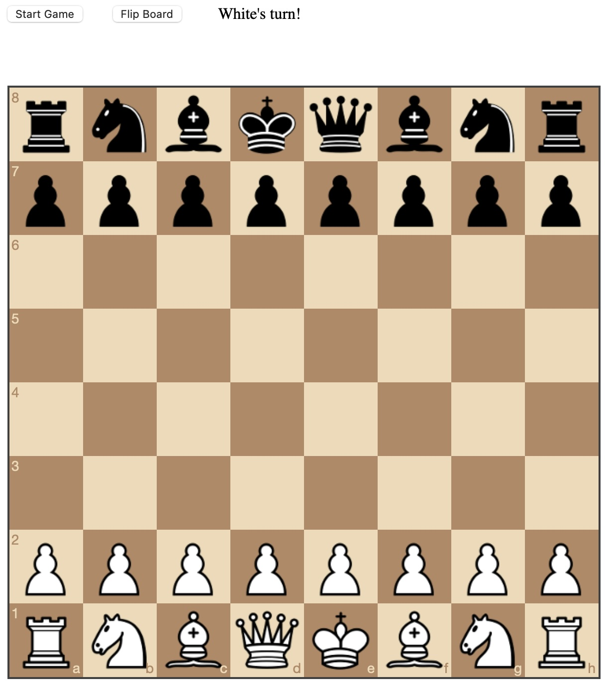

# Go Play Chess

#### TODO Game Logic Features
* [ ] Enabling Castling
* [ ] Pawn promotion with queen, bishop, horse, or rook
* [ ] Detecting self check and putting opponent in check
* [ ] Detecting checkmate
* [ ] Detecting stalemate or dead position https://en.wikipedia.org/wiki/Rules_of_chess
* [ ] Enable propose stalemate
* [ ] Online Multiplayer
* [ ] Pawn en passant, https://en.wikipedia.org/wiki/Rules_of_chess
 
#### Planned Features

* Write reinforcement learning algorithm like Q-Learning with experience replay and run it against stockfish / established algos
* Play single player or two player chess online, no login necessary
* Copy the link, share with anyone
* First 100 users play free
    * Afterward, pay $[TBD] to persist the game forever