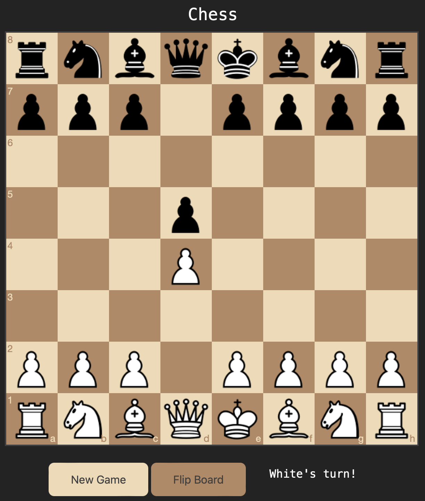

# Go Play Chess

A chess engine written in go with a frontend written in js.




### Getting Started

Run via

```shell
make run
```

or

```shell
make compile-and-run
```

Open a browser to [http://localhost:8080](http://localhost:8080) to play!

### TODO

- [ ] Convert Pawns To Selection
- [ ] Robust Checkmate Detection
- [ ] Stalemate detection
- [ ] Save game state
- [ ] Export game state
- [ ] Settable move timers