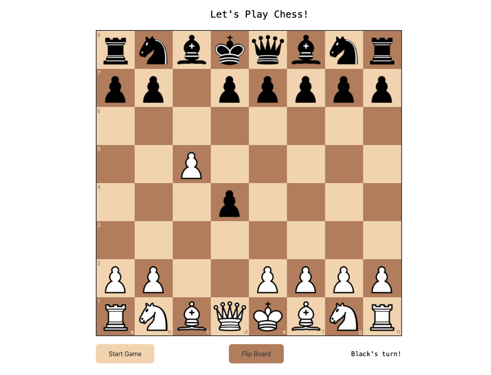

# Go Play Chess

A chess engine written in go with a frontend written in js.




### Getting Started

Run via

```shell
make run
```

or

```shell
make compile-and-run
```

Open a browser to [http://localhost:8080](http://localhost:8080) to play!

